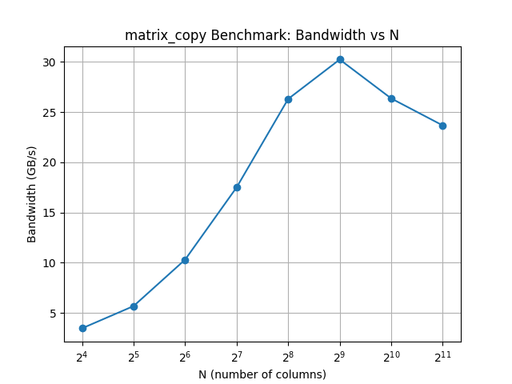

# Assignment 02: GPU Architecture and cuTile


The file `assignments/02_assignment/src/__main__.py` contains the main function that runs all the tasks for this assignment. Each task is implemented in a separate file in the same directory. The results of each task are printed to the console when the main function is executed.


## Task 1: GPU Device Properties


```{literalinclude} ../../assignments/02_assignment/src/task1.py
:language: python
```

**Output:**
```
CUDA Device Attributes:
        ClockRate: 2418000
        L2CacheSize: 25165824
        MaxSharedMemoryPerMultiprocessor: 102400
```


## Task 2: Matrix Reduction Kernel
a) cuTile kernel that reduces a 2D input matrix of arbitrary shape `(M, K)` along its **last** dimension (`K`)

```{literalinclude} ../../assignments/02_assignment/src/task2.py
:language: python
```

b) As `M` increases, the parallelization increases as more Streaming Multiprocessors (SM) are active. The theoratically performace maximum is when all SM's are used.
The per-kernel-process load increases with `K`, because every thread needs to load more data from the memory and performs more operations. The increase is non-linear due to the requirement that tile sizes must be powers of 2.
Any K that is not a power of 2 requires zero-padding to the next power of 2, which introduces computational overhead.


## Task 3: 4D Tensor Elementwise Addition

a) cuTile kernel that adds two 4D tensors `A` and `B` element-wise and stores the result in `C`. All tensors have identical shape and dimensions `(M, N, K, L)`. 

```{literalinclude} ../../assignments/02_assignment/src/task3.py
:language: python
```

b) **Benchmark** 
```{literalinclude} ../../assignments/02_assignment/src/task3_benchmark.py
:language: python
```
**Output:**
```
tensor_add_KL benchmark: 0.39 ms
tensor_add_MN benchmark: 0.67 ms
```

The `tensor_add_KL` kernel is faster than the `tensor_add_MN` kernel. This is because the data accessed per kernel program is continuous in memory.

---

## Task 4: Benchmarking Bandwidth

a) cuTile kernel that copies a 2D matrix of shape `(M,N)`

```{literalinclude} ../../assignments/02_assignment/src/task4.py
:language: python
```

b)
Benchmarking 
```{literalinclude} ../../assignments/02_assignment/src/task4_benchmark.py
:language: python
```

**Output:**
```{literalinclude} ../../assignments/02_assignment/src/task4_benchmark.out
```

Because the bandwidth was still increasing at `N=128`, we included a few more points up to `N=2048` to show the trend more clearly. The bandwidth increases as `N` increases, which is expected because larger matrices allow for better utilization of the GPU's memory bandwidth. However, the bandwidth reaches its peak at around `N=512` and then starts to decrease. Probably this is the point we reach hardware limits of the GPU.
