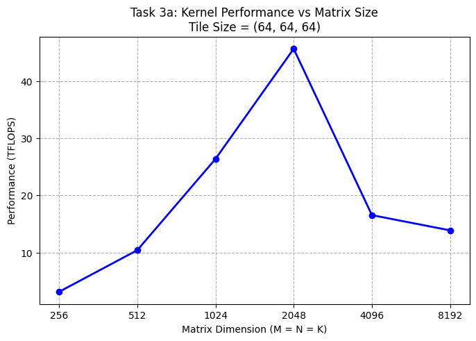
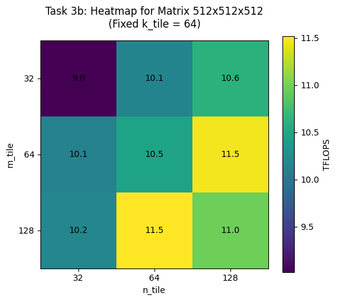
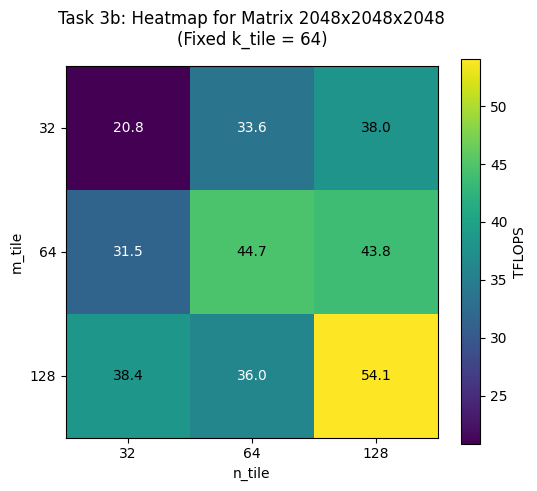
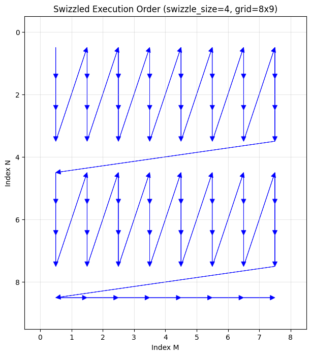
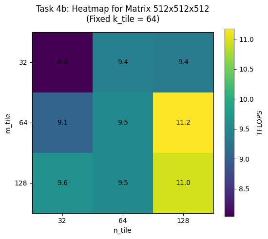
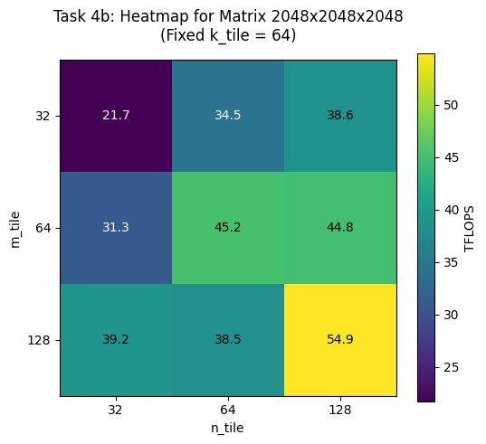

# Submission 03: Matrix Multiplication with cuTile

The file `assignments/03_assignment/src/__main__.py` contains the main function that runs all the tasks for this assignment. Each task is implemented in a separate file in the same directory. The results of each task are printed to the console when the main function is executed.

## Task 1: FP32 vs FP16 Performance

**Output:**
```
runtime torch.float16: 0.03595617373028527
runtime torch.float32: 1.84091664514234
speedup: 51.198902835197046
```

```{literalinclude} ../../assignments/03_assignment/src/task1.py
:language: python
```

---

## Task 2: Simple Matrix Multiplication Kernel


```{literalinclude} ../../assignments/03_assignment/src/task2.py
:language: python
```


---

## Task 3: Benchmarking the Matrix Multiplication Kernel


a) Benchmark your kernel with tile shapes `(64, 64, 64)` for square matrix multiplications of sizes:



b) Fix the matrix size at `2048 × 2048 × 2048`, as well as `512 × 512 × 512`, and benchmark all tile shape combinations (27 total):






**Output:**
```{literalinclude} ../../assignments/03_assignment/src/task_3_best_tile_shapes.txt
```


---

## Task 4: L2 Cache Optimization via Block Swizzling


```{literalinclude} ../../assignments/03_assignment/src/task4.py
:language: python
:pyobject: kernel_matmul_swizzle
```

```{literalinclude} ../../assignments/03_assignment/src/task4.py
:language: python
:pyobject: calc_position
```

PIDs are mapped into horizontal 'stripes' across the output matrix. Each stripe consists of 8 rows. Within a stripe, the PIDs traverse the tiles column by column: the first 8 PIDs compute a vertical column of 8 tiles downwards.
When the stripe is finished. The next stripe is computed, starting at row index 8.
At the last stripe the remaining heiht of the stripe (the rows) are calculated dynamically, to prevent out-of-bounds memory accesses.



#### Benchmarks





**Output:**
```{literalinclude} ../../assignments/03_assignment/src/task_4_best_tile_shapes.txt
```