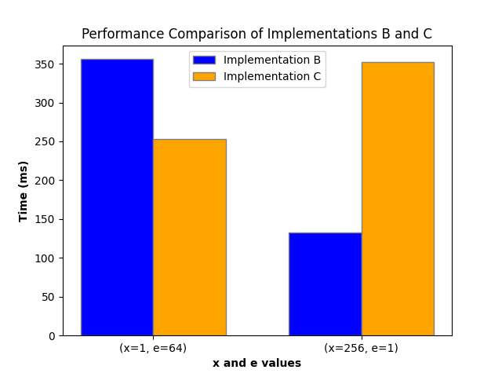
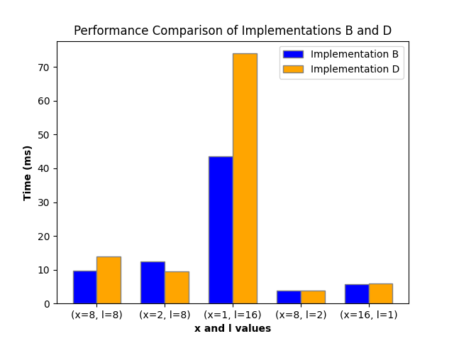
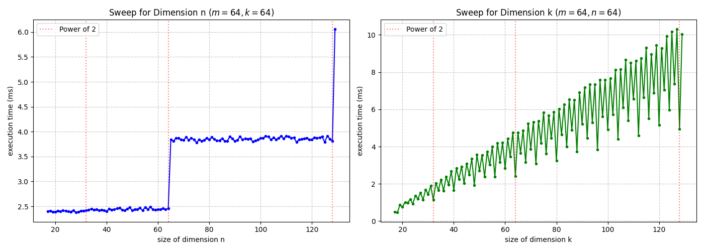

# Assignment 04: Tensor Contractions on GPUs

## Task 1: Tiled Contraction Kernel Variants

a) Classify all dimensions in the einsum string `eabklxy, ecklyz -> eabcxz`.

$$M = abx, N = cz, K = kly, C = e$$

b) Implement a cuTile kernel that computes the contraction `eabklxy, ecklyz -> eabcxz`. Use dimensions `xyz` as your GEMM dimensions. Sequentialize all other K-dimensions, parallelize the remaining dimensions. The kernel should work with arbitrary dimension sizes. You can hand them to your kernel as function arguments.
```{literalinclude} src/task_1b.py
:language: python
:pyobject: contraction
```
c) Implement a cuTile kernel that computes the contraction `eabklxy, ecklyz -> eabcxz`. Use dimensions `xyz` as your GEMM dimensions. Sequentialize all other K-dimensions, **as well as the `b` dimension**. Parallelize the remaining dimensions. The kernel should work with arbitrary dimension sizes. You can hand them to your kernel as function arguments.
```{literalinclude} src/task_1c.py
:language: python
:pyobject: contraction
```

Find one configuration (dimension sizes) where your kernel from b) performs better and one configuration where your new kernel from c) performs better.

Configuration: 
    a = 64
    c = 64
    k = 1
    l = 16
    y = 32
    z = 32
    b = 8



d) Implement a cuTile kernel that computes the contraction `eabklxy, ecklyz -> eabcxz`. **Use dimensions `xyzl` as your GEMM dimensions** by permuting the input tiles of the `ct.mma` instruction, as well as reshaping so that `y` and `l` are merged.

```{literalinclude} src/task_1d.py
:language: python
:pyobject: contraction
```


Find one configuration (dimension sizes) where your kernel from b) performs better and one configuration where your new kernel from d) performs better.
Configuration: 
    a = 16
    c = 16
    k = 8
    e = 16
    y = 16
    z = 16
    b = 16



e) Implement a cuTile kernel that computes the contraction `eabklxy, ecklyz -> eabcxz`. **Use dimensions `exyz` as your GEMM dimensions**, meaning that you perform a 3D `ct.mma` inside the kernel. Sequentialize all other K-dimensions, parallelize the remaining dimensions. The kernel should work with arbitrary dimension sizes.

```{literalinclude} src/task_1e.py
:language: python
:pyobject: contraction
```

Tensor shapes: A: (16, 15, 104, 33, 5, 4, 16), B: (16, 41, 33, 5, 16, 16), C: (16, 15, 104, 41, 4, 16)
```
1_b Time: 294.75 ms
1_e Time: 1310.34 ms
 ```


## Task 2: Kernel Fusion

a) Implement a cuTile kernel for the contraction `eabklxy, ecklyz -> eabcxz` where you fuse an elementwise tensor multiplication of a tensor `D` of shape `eabcxz` with the output tensor. The output tensor can be overwritten by the multiplication.

```{literalinclude} src/task_2.py
:language: python
:pyobject: fused_contraction_multiplication
```

b) Implement a kernel that computes the elementwise multiplication only. Compare runtime results of your fused kernel with sequentially calling the cuTile contraction kernel, then the elementwise multiplication. Choose tensor sizes such that the FLOP count of the contraction is similar to a 2048x2048x2048 matrix multiplication.

```{literalinclude} src/task_2.py
:language: python
:pyobject: multiply
```

Output:
```{literalinclude} src/task_2.out
:language: python
```

The fused kernel is actually slower than the separate kernels in this case. This is likely because the fused kernel has a higher register pressure, which can lead to lower occupancy and thus worse performance. Additionally, the fused kernel may not be able to fully utilize the GPU's resources due to the increased complexity of the operations being performed. In contrast, the separate kernels can be optimized independently, allowing for better performance in this specific case.


## Task 3: GEMM Dimension Size Sweep

a) Implement a contraction kernel that computes the contraction `ackm, bcnk -> abnm`. Assume fixed dimension sizes `|a| = 16`, `|b| = 16`, and `|c| = 32`. The kernel should be able to handle arbitrary sizes for dimensions `mnk`.

```{literalinclude} src/task_3.py
:language: python
:pyobject: contraction
```

b) Perform the following benchmarks, visualize your results and *explain* your findings:

Scaling the k-dimension increases the computational Operations, whereas expanding the n-dimension grows the DRAM utilization and traffic. 
Even Numbers of the k-dimension are faster then odd Numbers. 
Because the n dimension is padded to the next power of two, performance steps occur only when the dimension size crosses a power-of-two threshold (e.g., moving from 64 to 65), as this triggers a doubling of the allocated workspace.
For the same increase in k and m, the k-Dimension requieres a higher penalty for the execution time. That is because k is an contraction Dimension and creates more computational overhead by triggering more load and matmul operations.

