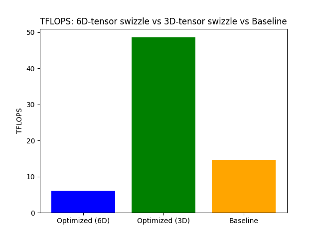

# Submission 05: Contraction Interface and L2 Optimization

In this assignment you will build a high-level configuration interface for tensor contractions, implement an optimizer that manipulates those configurations, and use it to derive and benchmark an L2-optimized cuTile kernel.

All code should be written in `src/`.


**Use FP16 data type for tensor inputs and outputs, accumulate in FP32.**
We assume row-major order for all tensors.

---

## Task 1: Config Class


```{literalinclude} ../../assignments/05_assignment/src/config.py
:language: python
:pyobject: Config
```

---

## Task 2: Generating a Basic Config

Write a function `generate_config` that takes an einsum string and a list of shapes for the input tensors (the output shape is implied by the einsum) and returns a basic `Config`.

```{literalinclude} ../../assignments/05_assignment/src/config.py
:language: python
:pyobject: generate_config
```
---

## Task 3: Optimizer Class

Implement a class `Optimizer` that wraps a `Config` and exposes methods to transform it.

a) **Implement** the function `split_dim(dim_id: int, outer_size: int, inner_size: int)`.

```{literalinclude} ../../assignments/05_assignment/src/optimizer.py
:language: python
:pyobject: Optimizer.split_dim
```
b) **Implement** the function `fuse_dims(dim_id_a: int, dim_id_b: int)`.

```{literalinclude} ../../assignments/05_assignment/src/optimizer.py
:language: python
:pyobject: Optimizer.fuse_dims
```

c) **Implement** the function `permute_dims(permutation: list[int])`.
```{literalinclude} ../../assignments/05_assignment/src/optimizer.py
:language: python
:pyobject: Optimizer.permute_dims
```

d) **Implement** the function `make_executable()`.
```{literalinclude} ../../assignments/05_assignment/src/optimizer.py
:language: python
:pyobject: Optimizer.make_executable
```

e) **Implement** the function `verify()`.
```{literalinclude} ../../assignments/05_assignment/src/optimizer.py
:language: python
:pyobject: Optimizer.verify
```
---

## Task 4: L2-Optimized Batched Contraction

NOTE: wenn ab 5 dimensionen performance schlechter, dann siehe assume_div_by hints der optional task in week 2.

Consider the batched matrix multiplication expressed as `cmk, ckn -> cmn` with dimension sizes $|c| = 4$, $|m| = |n| = |k| = 4096$.

a) Use your `generate_config` function from Task 2 to produce the initial `Config` for this contraction. **Report** the resulting config.

Output:
```{literalinclude} src/task4a.out
```


b) Use your `Optimizer` and the implemented functions from Task 3 to transform the basic config into an L2-optimized one, following the general L2-reuse pattern from the lecture.
```
config.dim_sizes = [ [...], |m_l2|, |n_l2|, |m_prim|, |n_prim|, |k_prim|]
```

**Choose** the sizes for `m_l2`, `m_prim`, `n_l2`, `n_prim` and **justify** your choice with respect to L2 cache reuse.
**Report** the final config.

Output:
```{literalinclude} src/task4b.out
```

### prim sizes
First we want to choose the optimal `m_prim, n_prim, k_prim` sizes of one mma instruction. 

We want to fit as many primitive operations of a matrix multiplication into one operation of mma as possible which is `m_prim * n_prim * k_prim`. 
In one mma operation the maximal memory is th max shared memory per block, which is 48 KiB for our machine. Using FP32 (4 bytes) for accumulation and FP16 (2 bytes) for inputs, the required memory for one mma is `mma_size = (2 * m_prim * k_prim + 2 * k_prim * n_prim + 4 * m_prim * n_prim)` bytes. 
Therefore want to maximize `m_prim * n_prim * k_prim` s.t. `mma_size = max_shared_memory_per_block`. 
Assuming `m_prim = n_prim` due to symmetry, leaves the optimization problem:

$$\max m_{prim}^2 \cdot k_{prim} \text{ s.t. } 4 \cdot m_{prim} \cdot k_{prim} + 4 \cdot m_{prim}^2 = \text{max shared memory per block}$$

This is solved for `m_prim = sqrt(max_shared_memory_per_block/12)`

In the case of 48 KiB of shared memory, `m_prim = n_prim = 64` and `k_prim = max_shared_memory_per_block / (4 * m_prim) - m_prim = 128` is optimal.

### L2 sizes

Next we want to choose `m_l2` and `n_l2` such that a swizzle block fits into the L2 cache. 
The size of the L2 cache on our machine is 24MiB. 
Every kernel loads `k_outer * m_prim * k_prim` values from matrix A and `k_outer * n_prim * k_prim` from B, respectively.
The amount of loaded values from A within a swizzle block is linear in `m_l2` and for B linear in `n_l2`.
Therefore, in total we need to fit `m_l2 * k_outer * m_prim * k_prim + n_l2 * k_outer * n_prim * k_prim` values into the L2 cache.
For optimal L2 use, we want to fill ~90-95% of the 24 MiB cache

$$24\text{ MiB} = {24 \cdot 1024 \cdot 1024 \text{ bytes} \over 2 \text{ bytes per BF16 value}} = 12582912 \text{ values}$$

Inserting the previously calculated values, we land on:

$$m_{L2} \cdot \frac {4096} {128} \cdot 64 \cdot 128 + n_{L2} \cdot \frac {4096} {128} \cdot 64 \cdot 128 \le 12582912$$
$$262144(m_{L2} + n_{L2}) \le 12582912$$
$$m_{L2} + n_{L2} \le 48$$

We want to maximize the values calculated per swizzle block, thus maximizing $m_{L2} \cdot n_{L2}$. Therefore, good values would be $m_{L2} = n_{L2} = 16$. While only using 67% of the L2 cache, we stick to sizes being a power of 2.

c) Implement the kernel

Implement a cuTile kernel that computes `cmk, ckn -> cmn` following your optimized config from b). **Verify** correctness of your kernel.

d) Use `triton.testing.do_bench` (or a similar benchmark function provided by cuTile/Torch) to measure the average kernel runtime. **Report** the achieved performance in TFLOPS.
**Compare** the performance of your L2-optimized kernel to a baseline kernel that maps BIDs in plain row-major order over `(c, m, n)` without any splitting or permuting. **Report** your findings.

```{literalinclude} src/task4.py
:language: python
:pyobject: task_c_and_d
```

```{literalinclude} src/task4.py
:language: python
:pyobject: swizzle_position
```

```{literalinclude} src/task4.py
:language: python
:pyobject: multiply
```

```{literalinclude} src/task4.py
:language: python
:pyobject: multiply_3d
```



```{literalinclude} src/task4_results.txt
```

`multiply` was our first implementation. It reshapes `A`, `B`, `C` into 6D tensors mirroring the tiling hierarchy (`c, m_outer, m_l2, k_outer, m_prim, k_prim`, ...), so each output tile is reached by indexing directly into its `(m_outer, m_l2)` / `(n_outer, n_l2)` position, matching the config from b) closely. It ended up slower than the row-major baseline.

To find out why, we added `multiply_3d`. It uses the same `swizzle_position` block-id decomposition, so both kernels compute the same `(m, n)` tile for a given block in the same order. The only difference is that `multiply_3d` indexes directly into the `(c, m, k)` / `(c, k, n)` / `(c, m, n)` tensors instead of the reshaped 6D ones. That separates two possible explanations: a bad swizzle pattern, or overhead from the 6D tensor layout.

`multiply`'s 6D loads carry four extra size-1 index dimensions per `ct.load`, which `multiply_3d` avoids. Once that overhead is gone, `multiply_3d` beats the baseline.