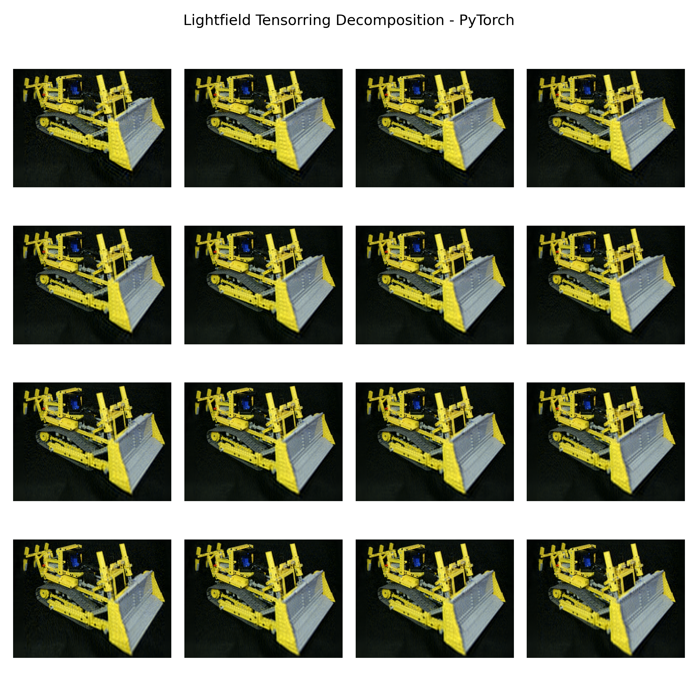
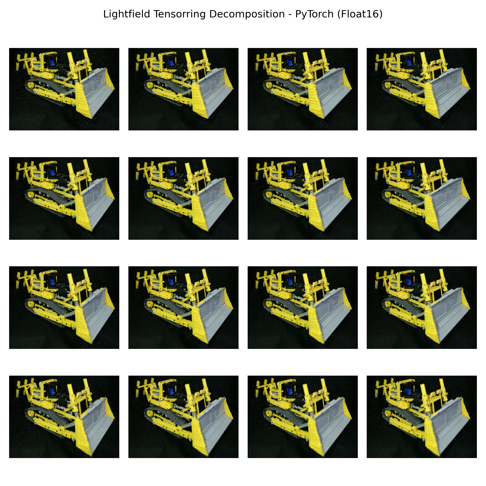

# Assignment 06: Multi-Input Einsum Contraction

In this assignment you will contract two intermediate tensors of a light-field tensor-ring decomposition loaded from disk, first by using PyTorch's `torch.einsum` as a reference, and then by building a cuTile kernel driven by the `Config`/`Optimizer` interface you implemented in Assignment 05.

All code should be written inside `src/` (`src/main.py` already contains some boilerplate code).

**Store** the [tensor data](https://cloud.uni-jena.de/s/4aeP53cgxoiXQEp) inside your assignment directory (next to the `src` directory). **Do not add the `data` directory to your git repository!**

We assume the following import conventions:

```python
import cuda.tile as ct
import cupy as cp
import numpy as np
import torch
import opt_einsum
import triton
```

---

## Task 1: PyTorch Reference Contraction

Two intermediate tensors of a light-field tensor-ring decomposition are stored in `data/lf_tr_64_intermediate.npz`:

| Name           | Shape             |
|----------------|-------------------|
| `tensor_acspx` | `(a, c, s, p, x)` |
| `tensor_bspy`  | `(b, s, p, y)`    |

The skeleton in `src/main.py` already loads both tensors as CPU numpy tensors.

a) **Classify** every index that appears in the two tensors. State which indices are of type M, N, K, or C (use the definitions from the lecture).

M = acx  N = by  K = sp   C =

b) **Write** the einsum string for the contraction and compute the result `tensor_abcyx` using `torch.einsum`. Convert all tensors to torch tensors and move them to the GPU before calling `torch.einsum`. Run the contraction **twice**: once with `torch.float32` inputs and once with `torch.float16` inputs (cast the tensors before contracting).

acspx, bspy -> abcyx

c) **Visualize** both results side-by-side by calling the `plot_tensor()` helper provided in `src/main.py`. Save the fp32 result to `results/torch_32.png` and the fp16 result to `results/torch_16.png`. **Report** if you see any visible differences between the two images.

FP16 Image:


FP32 Image:


I see a minor visible difference. The FP16 imgage is a bit blurrier.

---

## Task 2: Generating a Basic Config

Use the `generate_config` function you implemented in Assignment 05.

a) Call `generate_config` with the einsum string from Task 1 and the shapes of `tensor_acspx` and `tensor_bspy` to produce an initial `Config`. You may choose either fp32 or fp16 as the data types for the config.

b) **Report** the resulting config (all fields).

```
Config(
    data_type=DataType.FLOAT16,
    prim_main=PrimType.GEMM,
    prim_last=LastType.NONE,
    prim_first=FirstType.ZERO,
    dim_types=[<DimType.M: 0>, <DimType.M: 0>, <DimType.K: 2>, <DimType.K: 2>, <DimType.M: 0>, <DimType.N: 1>, <DimType.N: 1>],
    exec_types=[<ExecType.SEQ: 0>, <ExecType.SEQ: 0>, <ExecType.SEQ: 0>, <ExecType.SEQ: 0>, <ExecType.SEQ: 0>, <ExecType.SEQ: 0>, <ExecType.SEQ: 0>],
    dim_sizes=[4, 3, 64, 64, 1536, 4, 1152],
    strides=[[18874368, 6291456, 98304, 1536, 1, 0, 0], [0, 0, 294912, 4608, 0, 1152, 1], [21233664, 7077888, 0, 0, 4608, 1152, 1]]
)
```

---

## Task 3: Optimized Config

a) **Apply** optimizations to the configuration of Task 2 and ensure the config is valid and launchable. Optimize for performance.

b) **Report** the final optimized config (all fields).

```
Config(
    data_type=DataType.FLOAT16,
    prim_main=PrimType.GEMM,
    prim_last=LastType.NONE,
    prim_first=FirstType.ZERO,
    dim_types=[<DimType.M: 0>, <DimType.M: 0>, <DimType.N: 1>, <DimType.M: 0>, <DimType.N: 1>, <DimType.K: 2>, <DimType.M: 0>, <DimType.N: 1>],
    exec_types=[<ExecType.PAR: 1>, <ExecType.PAR: 1>, <ExecType.PAR: 1>, <ExecType.PAR: 1>, <ExecType.PAR: 1>, <ExecType.PRIM: 2>, <ExecType.PRIM: 2>, <ExecType.PRIM: 2>],
    dim_sizes=[12, 6, 18, 4, 4, 4096, 64, 64],
    strides=[[6291456, 256, 0, 64, 0, 1536, 1, 0], [0, 0, 256, 0, 64, 4608, 0, 1], [7077888, 1179648, 256, 294912, 64, 0, 4608, 1]]
)
```

```{literalinclude} src/task_try3.py
:language: python
:lines: 91-104
```

---

## Task 4: cuTile Kernel

a) **Implement** a cuTile kernel that computes the contraction following your configuration from Task 3.

b) **Verify** correctness by comparing the kernel output against the `torch.einsum` result from Task 1 using `torch.allclose` with a suitable tolerance.

c) Use `triton.testing.do_bench` to measure the average kernel runtime. **Compute** and **report** the achieved performance in TFLOPS.

Try1: TFLOPS kernel: 12.11

Try2: TFLOPS kernel: 40.80

Try3:
```
The result is correct!
torch.einsum:
Execution time of torch einsum: 11.46 ms
TFLOPS of torch einsum: 60.73

Optimized kernel:
Execution time of optimized kernel: 10.30 ms
TFLOPS of optimized kernel: 67.57
```

```{literalinclude} src/task_try3.py
:language: python
:lines: 109-159
```

```{literalinclude} src/task_try3.py
:language: python
:pyobject: contraction
```