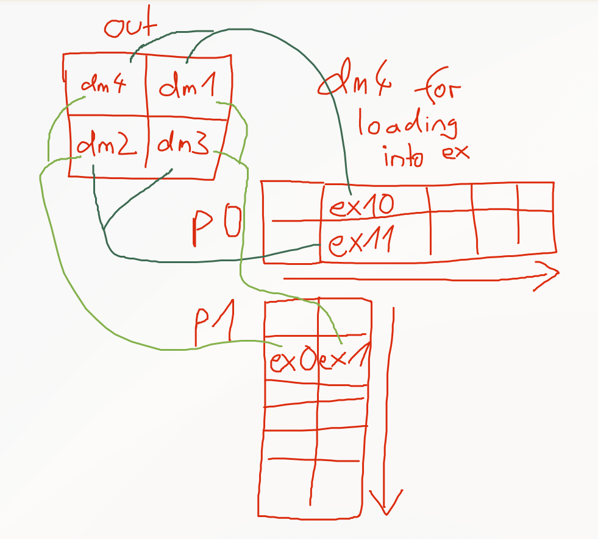

# Assignment 08: XDNA GEMM Kernel

This week you will write an XDNA kernel to perform a matrix multiplication on the NPU.
The XDNA kernel is a tensor kernel as it operates on tensor layouts.

## Data Layout and Data Movement

In the main memory the matrices are stored in row-major order (`in0: MK`, `in1: KN`, and `out: MN`).
During the data movement from L3 (main memory) to L1 (scratchpad), the matrices are tiled.
The dimensions are split as follows:

- `M->pm` with `p=2`, `m=8`,
- `N->qn` with `q=2`, `n=8`, and
- `K->rk` with `r=8`, `k=8`.

This yields the views `in0: pmrk`, `in1: rkqn`, and `out: pmqn`.
During the data movement to the L1 scratchpad memory, the layout is changed to `in0: prmk`, `in1: rqkn`, and `out: pqmn`.
The NPU scratchpad memory is zero-initialized during NPU setup, so within the tensor kernel you may assume that the output tensor memory is already zero.
When writing the output tensor, its layout is changed back to a matrix layout (`out: MN`).

## Task 1 — Verify Function ✅

**Implement** the `verify()` function for the matrix multiplication in `src/driver.py`.

## Task 2 — Instructions and Latencies

**Fill in** the table below with the instructions you will need for your tensor kernel.

| Instruction | Slot | Latency |
|-------------|------|---------|
|  vmul.f     |      |  6      |
vconv.fp32.bf16 cml1, x2 | same Slot as vshuffle M | 2
vconv.bfp16ebs8.fp32 ex7 | not the same Slot as vshuffle S | 4
vmac.f dm2, dm2, ex10, ex11, r3 | V | 6, 4 für akkumulator late forwarding

## Task 3 — Register Blocking

**Choose** a register blocking for your tensor kernel.
Assign the input and output tensors to the registers and explain your decision.
Keep in mind that the input tensors must be converted from BF16 to BFP16 (`bfp16ebs8`).

*Note: The same register may be reused for multiple tensors when their lifetimes do not overlap.*

| Tensor | Registers |
|--------|-----------|
| `out`  |           |
| `in0`  |           |
| `in1`  |           |

## Task 4 — Data Layouts and Pointer Updates
**Sketch** the data layout and the required pointer updates corresponding to your register blocking.

the idea was to hold all results permanently in the Accumulator Registers. but that would require them to occupy dm0-dm3 (one per resulting tile), leaving only one Accumulator Register for the conversion of the inputs `bf16 -> fp32 -> bfp16`

therefore, the computation is mainly loading bound. 

probably, only using dm0 and dm1 for the results would result in faster speeds, as loading would be significantly faster. but on the other hand, this would require to first compute half of the output, and later the rest. 

In one iteration of accumulating the output we load 2 tiles of in0 and 2 of in1, multiply the tiles and add them onto the output: 


## Task 5 — Implementation

1. **Implement** the tensor kernel in `src/matmul.s`.
   Do not use any control-flow instruction other than the final `ret lr`.

2. **Verify** your kernel with:

```bash
make run_matmul
```

## Task 6 — Performance

1. **Count** your instructions. What performance should your kernel achieve?

2. **Argue** whether your instruction count is minimal, or describe which optimizations could further reduce it.

