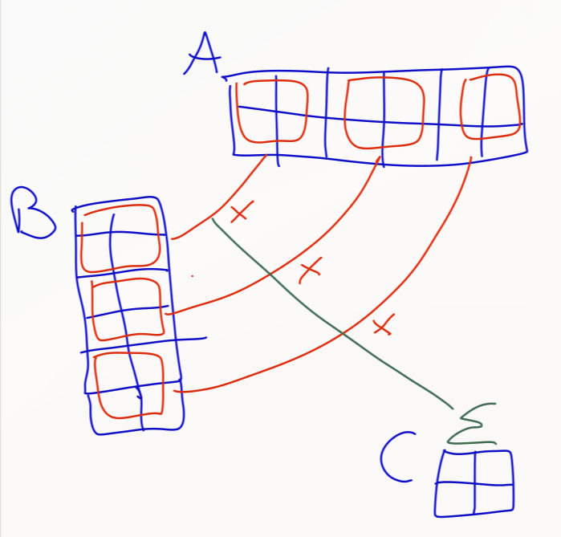

## Performance improvements by kernel-unfusing
On blocks of 2x2 tiles we currently convert both 2x2 blocks of A and of B from BF16 to BFP16 and then multiply them and accumulate in C.  



for multiple rows of two (in A, collumns in B respectively) we would need to reconvert values that we converted in a previous pass. 


that could be improved if we convert the whole matrices beforehand and save them in L1 Cache to be accessed for the matrix multiplication.

The expected improvement for the matrix multiplication kernel is getting from a 2/3 efficiency in the limit (efficiency here means the percentage of vmacs performed per line) to 1, as the conversion is not longer needed.
Of the following pseudocode for the "on the fly conversion" matmul we could save the first two lines.

```
vmul b0
vmul b1
vmac dm0 C00
vmac dm1 C01
vmac dm2 C10
vmac dm3 C11
```

But on the other hand, we would introduce extra work in converting the matrices beforehand. 