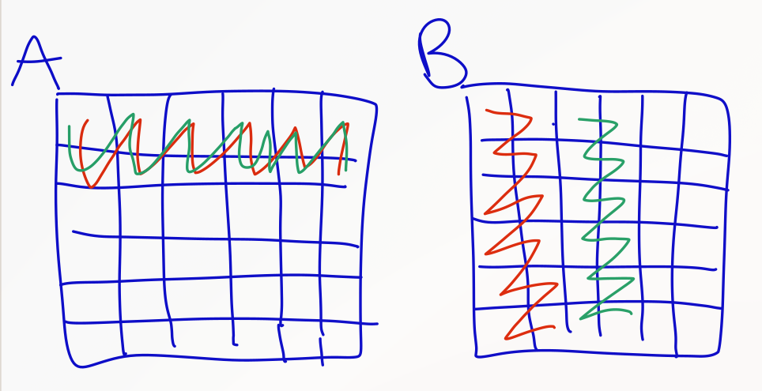
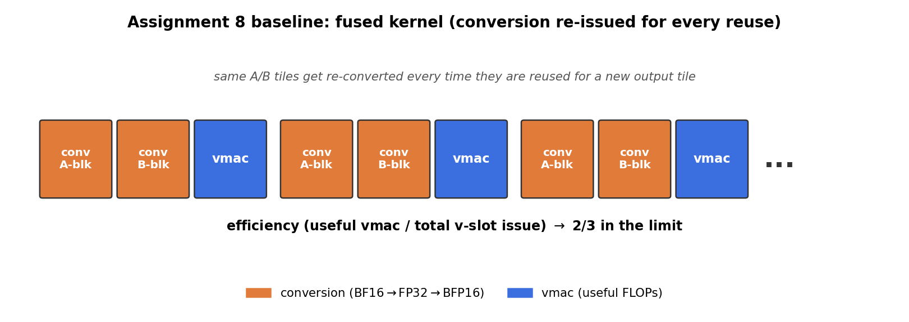
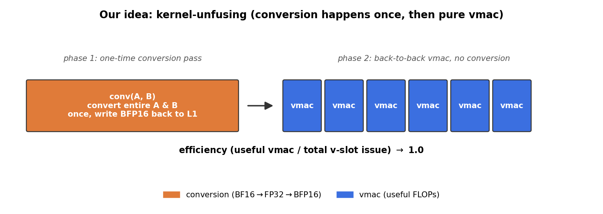
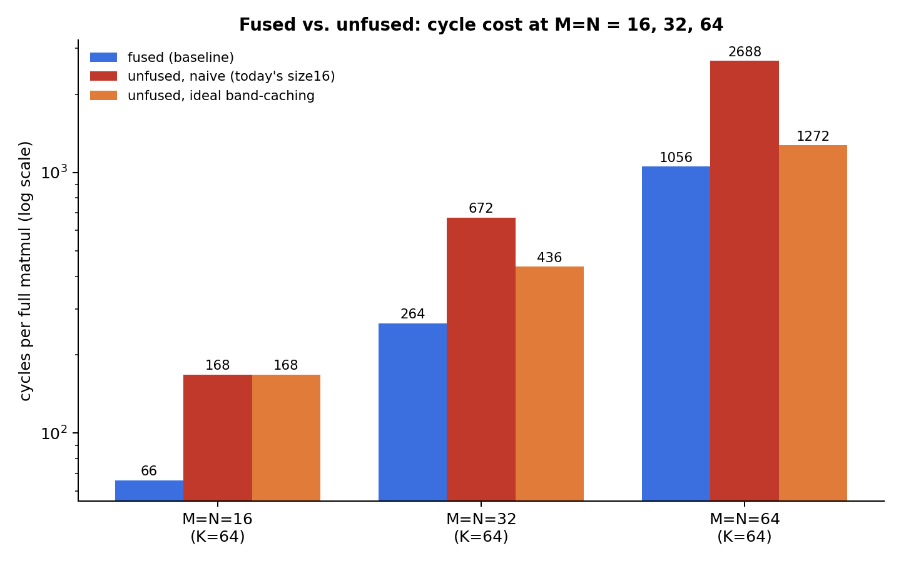

## Kernel-unfusing: converting once instead of on-the-fly

### Where we start: the Assignment 8 fused kernel

In Assignment 8 we wrote a single `matmul` kernel (see `src/baseline/matmul.s`) that does *everything* in one pass: for every step of the reduction it loads a block of `A` and a block of `B`, converts both from BF16 to BFP16 (`vlda.conv.fp32.bf16` → `vshuffle`/`vmul.f` → `vconv.bfp16ebs8.fp32`), and immediately multiply-accumulates the converted blocks with `vmac.f`. Conversion and compute are *fused* into the same instruction stream, bundle by bundle.

That is efficient as long as every converted block is used exactly once. It stops being efficient as soon as an `A`-tile or `B`-tile is reused for more than one output tile — which is the normal case in blocked, tiled matmul once you tile over more than a single 2×2 output block. The same source values then get pulled through the conversion pipeline again for every reuse:




The first sketch shows one output tile `C` built from one `A`-tile and one `B`-tile (each convert marked with a ×). The second sketch shows what happens once you sweep a whole strip: the same row of `A` (red zig-zag) and column of `B` (green zig-zag) get walked — and reconverted — for every output tile in that strip. Conversion work grows with the number of output tiles that reuse a given input tile, not just with the size of the input.

### Our idea: un-fuse conversion from compute

Instead of converting a block right before it's used, we convert **all of `A` and `B` once**, up front, and write the BFP16 result back into L1. Only afterwards does a second, pure-compute kernel run over that already-converted data. Concretely we split the single fused `matmul` into two kernels (`src/size16/matmul.s`):

- **`conv(in0, in1)`** — streams `A` and `B` through `vlda.conv.fp32.bf16` once, packs them to BFP16, and pushes them back into the *same* L1 buffers via `vst.push.576.conv.bfp16ebs8.fp32` / `vst.flush.512.conv`. No `vmac` happens here.
- **`matmul(in0, in1, out)`** — pulls the pre-converted BFP16 operands back in with `vlda.fill`/`vldb.fill` + `.pop.576` and issues nothing but `vmac` in the compute loop. No conversion instruction appears in this kernel at all.

The MLIR call sequence changes from `zero(out); matmul(in0, in1, out)` to `zero(out); conv(in0, in1); matmul(in0, in1, out)` — one extra core-local call, but no extra L2↔L1 traffic, since `conv` reads and writes the exact same L1 buffers the objectfifo already handed to the core.





### Why this should be faster, in the limit

Efficiency here means the fraction of v-pipe issue slots that do a useful `vmac` rather than conversion work. Of the "on-the-fly" pseudocode from the fused kernel

```
vmul b0
vmul b1
vmac dm0 C00
vmac dm1 C01
vmac dm2 C10
vmac dm3 C11
```

the first two lines are pure conversion overhead that repeats per reuse; the un-fused kernel removes them from the hot loop entirely. That moves the theoretical ceiling for the compute kernel from **2/3** (2 conversion ops for every set of 4 vmacs, in the limit of many reuses) to **1.0** — every issued vector instruction in `matmul` now does useful FLOPs. That is a statement about the *compute* kernel in isolation, though — it says nothing about whether the extra `conv` pass we introduced is actually paid off. The next section works that out with real numbers.

### Measured cost, and what it means for M=N = 16, 32, 64 (K=64 fixed)

Every line in our `.s` files is one VLIW bundle, i.e. one cycle, so counting bundles gives real cycle counts directly, no need to estimate:

| Kernel | Cycles | What it does |
|---|---|---|
| `baseline/matmul.s` (fused) | **66** | convert one A-band + one B-band + full K=64 `vmac`, for one 16×16 output tile |
| `size16/matmul.s :: conv` | **118** | convert A-band alone (52 cycles) + convert B-band alone (66 cycles) |
| `size16/matmul.s :: matmul` | **50** | pure `vmac` over an already-converted 16×16 tile — zero conversion instructions |

For the M=N=16 case that's implemented today, `conv`+`matmul` costs 118+50 = **168 cycles**, against 66 for the fused kernel — **2.5× slower**, not faster. Digging into *why*: `baseline/matmul.s` converts each K-slice of A/B once and immediately reuses it for all four output accumulators (`dm0`–`dm3`) before moving to the next K-slice. At M=N=16 there is only one 2×2 tile group, so the fused kernel already avoids any reconversion — the problem sketched in `image-1.png` only appears once you tile over *more than one* output-tile group, i.e. once M or N grows past 16. **Size 16 is intentionally the no-reuse case**; we don't expect unfusing to win there. The interesting question is what happens once reuse becomes possible, starting at M=N=32.

Let `a = M/16`, `b = N/16` be the number of 16-row / 16-col bands. With K=64 fixed, each of the `a·b` output-tile groups needs exactly one kernel call. Three scenarios:

- **Fused, looped** (wrap `baseline/matmul.s` in an outer a×b loop, the way Assignment 9/10 loop their kernel): `Total = a·b·66`.
- **Unfused, naive** — what `size16` actually does today, and what you'd get by just adding an outer loop around the existing `conv`+`matmul` calls with no further changes: `conv` and `matmul` are still called once per *tile group*, so every A-band gets reconverted for every N-band it appears in. `Total = a·b·168` — always worse than fused, at every size.
- **Unfused, ideal band-caching** — the only way unfusing can pay off: convert each of the `a` A-bands once and each of the `b` B-bands once, keep all of them resident in L1, then run `a·b` pure-`matmul` calls against the cache. `Total = a·52 + b·66 + a·b·50`.



| M=N | a=b | Fused | Unfused, naive | Unfused, ideal caching | Fused wins by |
|---|---|---|---|---|---|
| 16 | 1 | 66 | 168 | 168 | 2.5× |
| 32 | 2 | 264 | 672 | 436 | 1.65× |
| 64 | 4 | 1056 | 2688 | 1272 | 1.20× |

Even in the best case — unlimited L1, every band converted exactly once and cached for the whole computation — **unfusing is still slower than the fused baseline at all three sizes we plan to test.** The gap does shrink as M,N grow (2.5× → 1.65× → 1.20×), which is expected: `a·b·50` (the compute-only term) grows quadratically while `a·52+b·66` (the one-time conversion term) only grows linearly, so more reuse dilutes the fixed conversion cost. Solving `a·52 + b·66 + a·b·50 = a·b·66` for `a=b=n` gives a breakeven at **n ≈ 7.4**, i.e. **M=N ≈ 118** — well outside 16/32/64.

### The trade-off

Two separate problems, not one:

1. **The fixed per-band conversion cost isn't amortized fast enough at these sizes.** A band needs to be reused roughly 7–8 times before the one-time conversion cost pays for itself against the fused baseline's per-call reconversion; with K fixed at 64 that requires M,N in the 100+ range.
2. **`size16` doesn't currently attempt any reuse at all.** It calls `conv` then `matmul` back-to-back per tile group — i.e. it behaves like `a=b=1` always. Naively extending it to M=32/64 with an outer loop (mirroring Assignment 9/10's `scf.for` structure) lands on the "naive" row above: up to 2.5× *slower* than fused. Reaching the "ideal caching" numbers requires restructuring the MLIR core loop to hoist `conv(A-band)` outside the b-loop and `conv(B-band)` outside the a-loop, and keeping multiple converted bands resident in L1 simultaneously at once — more L1 pressure and more double-buffering complexity than the current single-band design, and a materially bigger implementation effort than what exists today.

**Conclusion:** for the M=N=16/32/64, K=64 test matrix we're planning, kernel-unfusing is a net loss, even under an idealized caching implementation. Size 16 is expected to show the worst case since it has no reuse to exploit at all; 32 and 64 should narrow the gap but not close it. The technique only becomes a genuine win once band reuse is high enough (M,N ≳ 128 in this configuration) to amortize the one-time conversion pass — outside the range we're testing.
