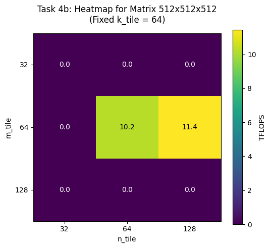
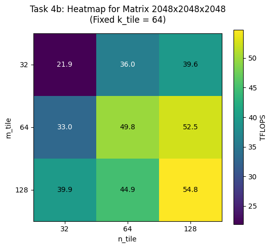

# Assignment 03: Matrix Multiplication with cuTile

The file `assignments/03_assignment/src/__main__.py` contains the main function that runs all the tasks for this assignment. Each task is implemented in a separate file in the same directory. The results of each task are printed to the console when the main function is executed.

## Task 1: FP32 vs FP16 Performance

**Output:**
```
16bit TFLOPs:  1.1449544748761349
32bit TFLOPs:  0.019409971572566145
```

```{literalinclude} ../../assignments/03_assignment/src/task1.py
:language: python
```

---

## Task 2: Simple Matrix Multiplication Kernel

**Output:**
```
16bit TFLOPs:  1.1449544748761349
32bit TFLOPs:  0.019409971572566145
```

```{literalinclude} ../../assignments/03_assignment/src/task2.py
:language: python
```


---

## Task 3: Benchmarking the Matrix Multiplication Kernel


a) Benchmark your kernel with tile shapes `(64, 64, 64)` for square matrix multiplications of sizes:


b) Fix the matrix size at `2048 × 2048 × 2048`, as well as `512 × 512 × 512`, and benchmark all tile shape combinations (27 total):


**Output:**
```
BEST tile shape for 512x512x512 is (128, 64, 128) achieving 12.07 TFLOPS
BEST tile shape for 2048x2048x2048 is (128, 128, 64) achieving 54.57 TFLOPS
```


---

## Task 4: L2 Cache Optimization via Block Swizzling


```{literalinclude} ../../assignments/03_assignment/src/task3.py
:language: python
:lines: 93-127
```

**Output:**
```
swizzle_kernel TFLOPs:  68.14132984785671
non_swizzle_kernel TFLOPs:  27.46563761972282
```

PIDs are mapped into horizontal 'stripes' across the output matrix. Each stripe consists of 8 rows. Within a stripe, the PIDs traverse the tiles column by column: the first 8 PIDs compute a vertical column of 8 tiles downwards.
When the stripe is finished. The next stripe is computed, starting at row index 8.
At the last stripe the remaining heiht of the stripe (the rows) are calculated dynamically, to prevent out-of-bounds memory accesses.




-> BEST tile shape for 512x512x512 is (128, 64, 32) achieving 10.77 TFLOPS



-> BEST tile shape for 2048x2048x2048 is (128, 128, 64) achieving 54.77 TFLOPS

