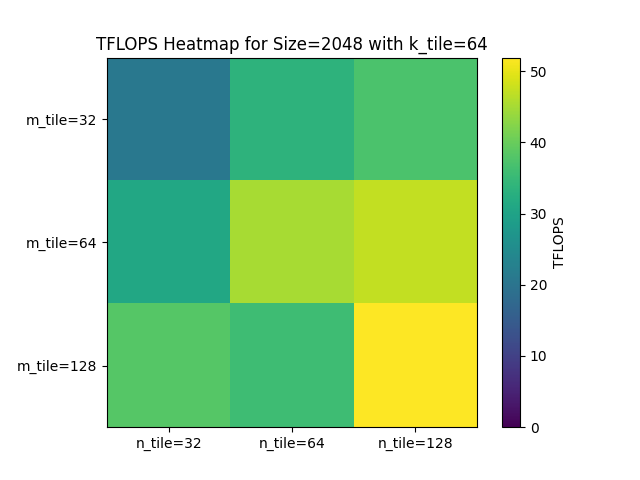
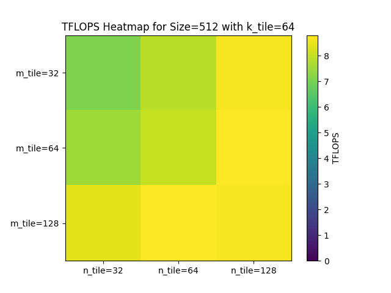

# Assignment 03: Matrix Multiplication with cuTile

## Task 1: FP32 vs FP16 Performance
TODO

a) **Your task** is to implement two cuTile kernels that each compute a matrix multiplication $A \times B = C$ with `shape(A) = (64, 4096)`, `shape(B) = (4096, 64)` and `shape(C) = (64, 64)`. 

1. **`kernel_fp16`**: Inputs `A` and `B` are `FP16`, accumulator/output `C` is `FP32`
2. **`kernel_fp32`**: Inputs `A` and `B` are `FP32`, accumulator/output `C` is `FP32`

Both kernels should use `ct.mma` to perform the tile-level multiply-accumulate. Use a single CTA (1 block in the grid) per kernel launch and use the fixed tile shape of `(m_tile=64, n_tile=64, k_tile=64)`.

**Verify** that both kernels compute correct results via `torch.matmul` using `torch.allclose`.

b) Use `triton.testing.do_bench` (or an equivalent benchmark function from `torch` / `cupy`) to measure the average kernel runtime for both variants. **Report** the measured runtimes and the resulting **speedup** of `kernel_fp16` over `kernel_fp32`.

---

## Task 2: Simple Matrix Multiplication Kernel

```{literalinclude} ../../assignments/03_assignment/src/task2.py
:language: python
```

---

## Task 3: Benchmarking the Matrix Multiplication Kernel

For the implementation, see `src/task3.py`.


a) Benchmark your kernel with tile shapes `(64, 64, 64)` for square matrix multiplications of sizes:


TODO interpretation of results

b) Fix the matrix size at `2048 × 2048 × 2048`, as well as `512 × 512 × 512`, and benchmark all tile shape combinations (27 total):

$$m\_{tile},\ n\_{tile},\ k\_{tile}\ \in \{32,\ 64,\ 128\}$$

Size 2048 × 2048 with fixed k_tile=64:


Size 512 × 512 with fixed k_tile=64:


Best-performing tile shape combination:
```{literalinclude} ../../assignments/03_assignment/src/task3_b_best_configs.txt
```


---

## Task 4: L2 Cache Optimization via Block Swizzling

a) **Your task** is to implement a swizzled matrix multiplication kernel. The requirements are the same as in _Task 2_, except block IDs should not be mapped in row-major order. Swizzle them for L2 cache reuse. You can assume a contraction dimension size of `4096`.

**Report** how you choose to map the BIDs and why. **Verify** correctness of the swizzled kernel against `torch.matmul`.

b) Repeat the tile shape sweep from _Task 3b_ for your swizzled kernel and **report** the best performing tile shape combination. **Compare** the performance of your swizzled kernel to the performance of your kernel from _Task 2_ for a matrix multiplication of shape `8192 × 8192 × 4096` (`m × n × k`).

